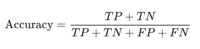
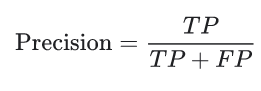
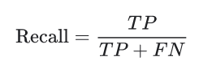

# Report for the project-based exam for DM882: Text Mining
## Option 1 : News Articles
### Luca Demma

---

# Introduction
The goal of this project is to implement a Natural Language Processing (NLP) pipeline to classify news articles taken from the front pages of 172 outlets in 11 countries using the semi-structured data source made by this project [http://sciride.org/news.html](http://sciride.org/news.html) , data used is present at this link provided by the teacher [https://news-mine.s3.eu-west-2.amazonaws.com/processed.tar.gz](https://news-mine.s3.eu-west-2.amazonaws.com/processed.tar.gz).

The implementation of the pipeline should provide 3 types of results:

-   **Text classification** starting from natural language text and the formal calculation of its accuracy
-   Based on the text classification execute data analysis to get **insights** from the data to get the proportion of articles on COVID-19, more specifically:

    - How many COVID-19 news have been issued as proportion of all articles in 2020
    - How many COVID-19 news have been issued as proportion of all articles in each month of 2020
    - How many COVID-19 news have been issued as proportion of articles in an outlet (e.g. CNN) in 2020

-   Getting the most commonly mentioned Named Entities in COVID-19 news doing Named Entity Recognition (NER)

For the implementation I used the Python programming language because is the most used language for NLP and there are a lot of libraries easily importable as the ones I used:
-   **NLTK** *([https://www.nltk.org/](https://www.nltk.org/))* and its modules:
    -   *word_tokenize*
    -   *WordNetLemmatizer*
    -   *pos_tag*
    -   *ne_chunk*
    -   *stopwords*
    -   *punkt*
-   **contractions**

Having to deal with huge quantity of data I chose to implement most of the scripts in a multi-process way using the power of the parallelism. This has been possible mainly because the majority of the operations are parallelizable not handling sequetial data. Using this technique permites to speed up the whole process up to 8 times in modern computers with multiple CPUs. To implement multiprocessing I used the Python module *pqdm*.


# Pipeline

The following picture describes the pipeline of the processing implemented by the code divided in 6 macro steps:
-   File cleaning
-   Extraction
-   Normalization
-   Classification
-   Classification accuracy
-   Analysis


Each step saves in the its output result in the `data` folder in the json format. For the steps that have as output big quantity of data it has been chosen to split the results in sub-files for each news outlet to avoid problems related to out-of-memory.

## Step 0 : File cleaning
The first step is related to file cleaning and preparation, in this step I started to clean the source data and to make it easily consumable by the Python implentation of the pipeline.

To do so I followed the following actions:

### Removing old articles
Removing of all the articles issued before the 2019, as stated in the project description to handle a reasonable count of news we use only the 2019 and 2020 ones. 

To do so I run a simple bash command that finds all the files name that don't start with `2019` and `2020`:

```bash
find . -type f ! -name '2019*' -and ! -name '2020*' -delete
```

### Unzipping all the files
To speed up and make the processing easier I choose to pre-decompress all the files present in the .gzip format.

To do so I used a simple bash command to decompress all the files found in the folders recursively

```bash
gunzip -rv .
```

### Remove all the non english news outlets
My implementation is based on the handle of just a single language of news, for this reason in this step I'm gonna remove from the news outlets list all the outlets that are not in english language.

To do so I wrote a Python script `english.py` that uses the file provided by the teacher `AvailableOutlets.txt` to delete all the folders that use non english language. After this removal the news outlets became 91.

After this steps the data has been prepared to be consumed by the pipeline in a more convient way.

## Step 1 : Extraction
In this step I aim to clean the data source from all the unnecessary fields and to give a structure that can make it easier the handling.

I had to think how to handle all the data to avoid out-of-memory problems because my first thought has been to save every cleaned news data in a single json file but this idea fastly showed its limitations because of the data size related problems, the python script was often crashing when creating the huge single json file with out-of-memory error.

For this reason I chose to handle the data by steps for every outlet, this required some more reasoning but it made possible the handling of the huge data source.

My goal here was to strip down the input data giving a structure, to do this I use a Python script `extractor.py` where I read all the articles for each outlet and I keep only the following fields in the following json format:

```json
{
    "newspaper": "abcnews.go.com",
    "date": "20190101",
    "title": "Shutdown talks broken between...",
    "description": "As the government shutdown en...",
    "is_covid_source": false  // comes from the source, keyword based
}
```

I save all the article in the format shown previously in an array of objects in `./data/structured_resource/outlet_name` where *outlet_name* is the file name of the json rapresented by the outlet name e.g. *abcnews.go.com*

In this script I used multiprocessing to speed up considerably the execution speed.

## Step 2 : Normalization
This step is crucial to transform natural language in a structured data source that can be handled by a software.

In my pipeline I used the following normalization techniques for titles and descriptions in the following order (implementation in `normalizer.py` file):
-   **to lower case** : transforming the texts to lower case to make easier matching for the same words with different casing
-   **expanding contractions** : expanding the english language contractions (e.g. I'm -> I am). I used the the module [contractions](https://github.com/kootenpv/contractions)
-   **tokenization** : using *nltk.tokenize.word_tokenize* that uses the NLTK's reccomended tokenizer to split a sentence in tokens. Internally it uses a series of regular expressions to split the tokens by white spaces and punctuations.
-   **removing punctuations** : using Python list comprehensions to remove all the tokens that contain punctuations. For this I'm using the Python built-in function `isalnum()` that returns true if a string contains only alphanumeric characters, I added a condition to not remove the occurrences of *'covid-19'*.
    ```python
    [token for token in tokens_list if (token.isalnum() or token == "covid-19")]
    ```

-   **lemmatization** : using WordNet corpus lemmatizer WordNetLemmatizer to lemmatize the tokens got in the previous step. I choose to lemmatize instead of stemming because stemming is not so efficient due to the fact that tends to stem to unwanted words.
-   **removing stopwords** : stop words are commonly used words that occure frenquently and usually don't provide additional information. For doing this I used the NLTK corpus *stopwords* that contains a list of stopwords in 11 languages. 
    
    This is the list for english *(Taken from: [https://www.nltk.org/book/ch02.html](https://www.nltk.org/book/ch02.html))*:
    ```python
    ['i', 'me', 'my', 'myself', 'we', 'our', 'ours', 'ourselves', 'you', 'your', 'yours',
    'yourself', 'yourselves', 'he', 'him', 'his', 'himself', 'she', 'her', 'hers',
    'herself', 'it', 'its', 'itself', 'they', 'them', 'their', 'theirs', 'themselves',
    'what', 'which', 'who', 'whom', 'this', 'that', 'these', 'those', 'am', 'is', 'are',
    'was', 'were', 'be', 'been', 'being', 'have', 'has', 'had', 'having', 'do', 'does',
    'did', 'doing', 'a', 'an', 'the', 'and', 'but', 'if', 'or', 'because', 'as', 'until',
    'while', 'of', 'at', 'by', 'for', 'with', 'about', 'against', 'between', 'into',
    'through', 'during', 'before', 'after', 'above', 'below', 'to', 'from', 'up', 'down',
    'in', 'out', 'on', 'off', 'over', 'under', 'again', 'further', 'then', 'once', 'here',
    'there', 'when', 'where', 'why', 'how', 'all', 'any', 'both', 'each', 'few', 'more',
    'most', 'other', 'some', 'such', 'no', 'nor', 'not', 'only', 'own', 'same', 'so',
    'than', 'too', 'very', 's', 't', 'can', 'will', 'just', 'don', 'should', 'now']
    ```
    and I used this list comprehions command to check if a token is included in the list to remove it:
    ```python
    [token for token in tokens_list if not token in stop_words]
    ```


## Step 3 : Classification
To classify the news articles I used the normalized data produced in the previous step to implement a Naive Bayes classifier from scratch.

A Naive Bayes classifier is a supervised learning algorithm which is based on Bayes Theorem. It's a probabilistic classifier because choses the class of an input based of a probability of its features.

Bayes Theorem formula: 

Where:

- P(A|B) is Posterior probability
- P(B|A) is Likelihood probability
- P(A) is Prior Probability:
- P(B) is Marginal Probability

### Getting the training sets
To use the formula for the text classification problem we need to calculate the probabilities that each word has in covid and non covid articles. To do so two training sets are needed for the training, the TRUE training set and the FALSE one, that rappresent respectively the set of articles that are covid related and the one that is not.

To get the training set I wrote a script `getTrainingSets.py` where i divide the normalized articles data in the TRUE and FALSE set. 

In the FALSE set I used the articles written before 2020 because covid was still undected and for the TRUE set I used the articles that contain in the title or in the description the keywords *covid-19* or *coronavirus*.

The training sets have been saved respectively in `./data/training_covid` and `./data/training_NOT_covid`

### Getting the words probabilities
Having the FALSE and TRUE training sets I can loop on them to calculate the frequencies of the words occurencies and from them calculate the probability for each word using `frequency.py`

I'm using a Python default_dict data structure to ease the process of creating the dictionary to save the words frequencies and probabilities.

I chose to treat in the same way the words found in the title and the ones found in the description. 

Having the words frequency I calculate the probability of each word for the both sets (diving the frequency of the word by the sum of all the occurences): 

```python
for word in tqdm(isCovidFreq):
    isCovidProb[word] = isCovidFreq[word] / isCovidWordsLength
```

in this way I get the most commond words in covid news and non covid saved in `./data/prob_covid.json` and `./data/prob_NOT_covid.json`.

The most 20 common words for covid news:
```json
"coronavirus": 0.043835909923861924,
"covid-19": 0.015808012474694544,
"news": 0.010715819839904057,
"ha": 0.009922155787593942,
"new": 0.008365884681941676,
"pandemic": 0.008240723643182362,
"case": 0.006377259274490732,
"time": 0.005009907138240168,
"say": 0.004845602728821659,
"trump": 0.004683742003155996,
"people": 0.004504464476924605,
"lockdown": 0.004464077049082143,
"health": 0.004126004509529567,
"outbreak": 0.0041117867131493825,
"wa": 0.0039550355080578475,
"death": 0.0037163542513254984,
"said": 0.003695160848596286,
"world": 0.0035532938990902566,
"state": 0.0033374499777935793,
"online": 0.003325098267188294,
```

The most 20 common words for NON covid news:
```json
"news": 0.010683131939110142,
"ha": 0.008041611622448533,
"wa": 0.006844409412116912,
"new": 0.006049156914812433,
"time": 0.005171104253908384,
"online": 0.005122369938670393,
"trump": 0.004485226975135559,
"daily": 0.003886308735628415,
"say": 0.0037605308472398883,
"year": 0.0036743987658769293,
"mail": 0.0034204825461542467,
"star": 0.0031140344278150615,
"one": 0.002730815712720413,
"said": 0.0027005474477373444,
"world": 0.002651965678131895,
"video": 0.0026342061550171606,
"president": 0.0026308260649487596,
"first": 0.002223248220952618,
"day": 0.002182060900166639,
"woman": 0.002161523440796165,
```

### Classification
Now that we have the tokens probabilities for the TRUE and the FALSE sets we can use them to calculate the probability of each token set being part of one of the two sets by multiplying the probabilities for each token and multiplying by prior probability and see which classification gives us a higher score. The script that handles this is `classifier.py`.

Doing like this I found 2 problems:
-   Tokens that are in a set and not in the other crash the script because the value is not found in the dictionary. To solve this problem for tokens that don't have a probability value I use the lowest probability for that tokens set.
-   Using the multiplications of probabilities we can incurr in numerical underflow: being the values very small and multuplyng them by each other with large inputs the result is a very small number and it can get unstable. To fix this I used the sum of the logs of the probabilities instead of the multiplication of them. This fixes the small number problem and gives more reasonable classification scores.
```r   
P(yi | x1, x2, …, xn) = log(P(x1|y1)) + log(P(x2|y1)) + … log(P(xn|y1))+ log(P(yi))
```

To get the prior probabilities I used the provided flag *is_covid*.

The result of the classification is stored in `./data/classification_results` for each outlet in json format. The class is of every news is found in the field *class* and can be *IS COVID* or *NOT COVID*. Is also possible to see the calculated score for each news for both classes.

It's important to note the Naive Bayes classifier doesn't take care of the postion of the words and their relations because we provide the data as a bag of words but it's an algorithm that has low variance also having high bias, that means that works well in classification despite this.


## Step 4 : Classification Accuracy Verification
After the classification we need to verify how correct is the classification, to do so I used two formal ways to calculate correctness using `accuracy.py`:
-   **Accuracy** : tells us how many input have been classified correctly with the following formula: 

    This gives us a general view of the correctness of the classification because is not efficient in class-imbalanced data set.

    The accuracy calculated by the script using the flag *is_covid* from the source is of **0.95**
-   **Precision / Recall** : this method gives us better insight because tells us:
    - **Precision** : which proportion of the TRUE set is correct (i.e. it's high if the model produces few false positives) 
  
        The precision calculated by the script using the flag *is_covid* from the source is of **0.73**
    - **Recall** : which proportion of the "real" positives has been correctly classified. (i.e. it's high if the model produces few false negatives) 
  
        The precision calculated by the script using the flag *is_covid* from the source is of **0.95**

    From the results (saved in `./data/accuracy_results.json`) we can see that the classifier tends to be more oriented in classyfing articles to be about covid because of the not sho how precision. But if an article is about covid the model classifyes it correctly 95% of the times.

## Step 5 : Analysis
Now that we have the classified data we can execute data analysis on it for this project we are going to:
- Getting proportions of:
    - How many COVID-19 news have been issued as proportion of all articles in 2020
    - How many COVID-19 news have been issued as proportion of all articles in each month of 2020
    - How many COVID-19 news have been issued as proportion of articles in an outlet (e.g. CNN) in 2020

-   Getting the most commonly mentioned Named Entities in COVID-19 news doing Named Entity Recognition (NER)

### Proportions
The script the reads the classyfied data and returns the proportions is the `filters.py` file and saved as json files in `./data/analysis`

### How many COVID-19 news have been issued as proportion of all articles in 2020?
| total_2020 | covid_2020 | percentage_2020 |
| ---------- | ---------- | --------------- |
| 4249012    | 1407326    | 33.12%          |

### How many COVID-19 news have been issued as proportion of all articles in each month of 2020?
| month | total  | covid  | percentage |
| :---- | :----- | :----- | :--------- |
| 1     | 440797 | 37223  | 8.44       |
| 2     | 420264 | 59917  | 14.25      |
| 3     | 473143 | 236532 | 49.99      |
| 4     | 461819 | 271744 | 58.84      |
| 5     | 469991 | 220139 | 46.83      |
| 6     | 467633 | 146521 | 31.33      |
| 7     | 469513 | 146564 | 31.21      |
| 8     | 435350 | 123191 | 28.29      |
| 9     | 403165 | 103845 | 25.75      |
| 10    | 205976 | 61303  | 29.76      |

### How many COVID-19 news have been issued as proportion of articles in an outlet (e.g. CNN) in 2020?
| outlet                  | total  | covid | percentage         |
| :---------------------- | :----- | :---- | :----------------- |
| 9news.com.au            | 41826  | 10410 | 24.888825132692585 |
| abc.net.au              | 103835 | 21978 | 21.166273414551934 |
| abcnews.go.com          | 113842 | 19036 | 16.721420916709125 |
| afr.com                 | 105897 | 16525 | 15.604785782411211 |
| aljazeera.com           | 65290  | 11458 | 17.549395006892325 |
| apnews.com              | 158115 | 20946 | 13.247319988615882 |
| bbc.com                 | 117145 | 17224 | 14.703145674164498 |
| bostonglobe.com         | 116534 | 18877 | 16.198705957059744 |
| breakingnews.ie         | 13089  | 890   | 6.799602719841088  |
| breitbart.com           | 145339 | 22448 | 15.445269335828648 |
| businessinsider.com     | 118619 | 25666 | 21.637343090061457 |
| cbc.ca                  | 45757  | 7228  | 15.796490154511877 |
| cbsnews.com             | 116566 | 21337 | 18.30465144210147  |
| channel4.com            | 7175   | 1673  | 23.317073170731707 |
| chicagotribune.com      | 107117 | 13425 | 12.533024636612302 |
| cnbc.com                | 110345 | 28890 | 26.181521591372512 |
| csmonitor.com           | 30797  | 4606  | 14.956002208007273 |
| ctvnews.ca              | 74349  | 18693 | 25.142234596295847 |
| dailymail.co.uk         | 608931 | 44763 | 7.3510791863117495 |
| dailystar.co.uk         | 186203 | 8846  | 4.750729043033679  |
| dw.com                  | 65231  | 12850 | 19.699222762183624 |
| economist.com           | 26007  | 3942  | 15.157457607567194 |
| edition.cnn.com         | 68227  | 11652 | 17.07828279127032  |
| euronews.com            | 89274  | 12762 | 14.295315545399557 |
| express.co.uk           | 247580 | 37685 | 15.221342596332498 |
| foxnews.com             | 223856 | 31809 | 14.209581159316704 |
| france24.com            | 51711  | 10215 | 19.754017520450194 |
| globalnews.ca           | 83252  | 22147 | 26.6023639071734   |
| huffpost.com            | 72479  | 13583 | 18.740600725727454 |
| independent.co.uk       | 95415  | 12939 | 13.560760886653043 |
| independent.ie          | 104749 | 8436  | 8.053537503937985  |
| inquirer.com            | 62919  | 12987 | 20.640823916464026 |
| irishexaminer.com       | 52872  | 6027  | 11.399228325011348 |
| irishmirror.ie          | 21271  | 1494  | 7.023647219218654  |
| irishtimes.com          | 98651  | 14930 | 15.134159815916716 |
| itv.com                 | 28321  | 5476  | 19.335475442251333 |
| latimes.com             | 137335 | 24979 | 18.18837150034587  |
| liverpoolecho.co.uk     | 80657  | 11474 | 14.225671671398638 |
| macleans.ca             | 14993  | 3888  | 25.93210164743547  |
| metro.co.uk             | 117775 | 12794 | 10.863086393547018 |
| mirror.co.uk            | 277786 | 23103 | 8.316833821718877  |
| montrealgazette.com     | 52976  | 2857  | 5.393008154636061  |
| morningstaronline.co.uk | 15395  | 1637  | 10.633322507307568 |
| msnbc.com               | 74369  | 17599 | 23.664430071669646 |
| nbcnews.com             | 98405  | 20243 | 20.57110919160612  |
| news.com.au             | 106349 | 16531 | 15.54410478706899  |
| news.sky.com            | 63026  | 16221 | 25.736997429632215 |
| news.yahoo.com          | 285447 | 54633 | 19.139454960115188 |
| newshub.co.nz           | 56246  | 13216 | 23.496781993386197 |
| newsweek.com            | 104713 | 15537 | 14.837699235052    |
| npr.org                 | 40125  | 9035  | 22.517133956386292 |
| nypost.com              | 124737 | 16872 | 13.526058827773635 |
| nytimes.com             | 56931  | 14589 | 25.62575749591611  |
| nzherald.co.nz          | 131757 | 19697 | 14.949490349658841 |
| politico.com            | 92790  | 14583 | 15.716133204009052 |
| rcinet.ca               | 17250  | 3295  | 19.10144927536232  |
| reuters.com             | 168841 | 42059 | 24.910418677927755 |
| rfi.fr                  | 19179  | 7779  | 40.559987486313155 |
| rnz.co.nz               | 32156  | 8992  | 27.963677074262968 |
| rt.com                  | 65232  | 10037 | 15.386620063772382 |
| rte.ie                  | 19888  | 4072  | 20.474658085277554 |
| sbs.com.au              | 38595  | 8372  | 21.691929006347973 |
| scoop.co.nz             | 139235 | 15549 | 11.167450712823644 |
| scotsman.com            | 37910  | 5305  | 13.99366921656555  |
| slate.com               | 47229  | 5589  | 11.833830908975418 |
| smh.com.au              | 139672 | 17625 | 12.618849876854345 |
| standard.co.uk          | 116295 | 13015 | 11.191366782750762 |
| stuff.co.nz             | 153814 | 20955 | 13.623597331842355 |
| telegraph.co.uk         | 198279 | 23807 | 12.006818674695756 |
| theage.com.au           | 124252 | 18327 | 14.74986318127676  |
| theatlantic.com         | 60181  | 6612  | 10.98685631677772  |
| theglobeandmail.com     | 139550 | 23619 | 16.92511644571838  |
| theguardian.com         | 176381 | 29780 | 16.883904728967405 |
| thehill.com             | 96405  | 19995 | 20.740625486229966 |
| thejournal.ie           | 62828  | 7621  | 12.129942064047876 |
| thestar.com             | 53139  | 5633  | 10.60050057396639  |
| thesun.co.uk            | 330374 | 33992 | 10.288945255982613 |
| thesun.ie               | 194499 | 19842 | 10.201594866811655 |
| thetimes.co.uk          | 279829 | 32993 | 11.790414860504093 |
| thewest.com.au          | 86792  | 12005 | 13.831919992626048 |
| time.com                | 61556  | 9851  | 16.003314055494183 |
| torontosun.com          | 66162  | 7268  | 10.985157643360237 |
| upi.com                 | 72692  | 9546  | 13.13211907775271  |
| usatoday.com            | 139840 | 22940 | 16.40446224256293  |
| vancouversun.com        | 50976  | 2117  | 4.152934714375393  |
| walesonline.co.uk       | 94705  | 12933 | 13.65608996357109  |
| washingtonpost.com      | 189905 | 28805 | 15.168110370974961 |
| washingtontimes.com     | 94438  | 13882 | 14.699591266227579 |
| westernjournal.com      | 43038  | 5225  | 12.140434035038803 |
| wnd.com                 | 75712  | 8899  | 11.753751056635672 |
| wsj.com                 | 122570 | 25730 | 20.99208615485029  |

## Named Entity Recognition (NER)
The goal of NER is to find the most commong entities in a text using corpora to distinguish words that refers to some entity.

I used NLTK ne_chunk and pos_tag in the `ner.py` script to extract the most common entities of covid related news.

Before using NLTK's NER I tryed with the Stanford one but it was extremely slow for the data size.

The NLTK NER pipeline requires to provide to the ne_chunk function pos-tagged text.

The NLTK module for NERing the text is based on a supervised machine learning model named MaxEnt classifier. This algorithm uses a manually annotated corpus specifically for Entity Recognition.

For the training of the model have been provided various features as: the POS tag, if the words starts with capital letter, if the word is a lemma, the pos tag of the previous and next word.

The result of the execution of the script is saved in `ner_total.py`.

Here the most common Entities found by the script:
```json
"Coronavirus / GPE": 207047,
"Trump / PERSON": 86396,
"China / GPE": 80622,
"U.S. / GPE": 75092,
"UK / ORGANIZATION": 48854,
"ABCNews / ORGANIZATION": 40700,
"DailyMailOnline / PERSON": 40337,
"Australia / GPE": 38269,
"FoxNews / PERSON": 33981,
"Guardian / GPE": 31284,
"US / GSP": 30735,
"LosAngeles / GPE": 29122,
"WashingtonPost / ORGANIZATION": 28962,
"DonaldTrump / PERSON": 27477,
"NewYork / GPE": 25263,
"Chinese / GPE": 24996,
"Globe / ORGANIZATION": 24954,
"Mail / PERSON": 23939,
"Trump / GPE": 23750,
"BusinessInsider / ORGANIZATION": 23298,
"WSJ / ORGANIZATION": 23122,
"Irish / GPE": 22612,
"Ireland / GPE": 22520,
"CBSNews / ORGANIZATION": 22408,
"Reuters / ORGANIZATION": 21283,
"Italy / GPE": 21232,
```

The NER found a lot of names related to the newspapers titles that could be omitted from the list.


# How to run the code
The code expects as input pre-cleaned files following the Step 0 steps in a folder specified in `RESOURCE_PATH` variable for the `extractor.py` file and `DIRS_BASE_PATH` for the `english.py` file.

After this pre-configuration the code can be launched executing the script `RUN_FULL_PIPELINE.py` that executes the steps from 1 to 5.

**Sometimes the complete script can fail especially after the last call of ner.py file. If this happens the file contains the name of the scripts to be launched in the correct order**

The results of the various scripts are saved in the `./data` folder as described in the steps.